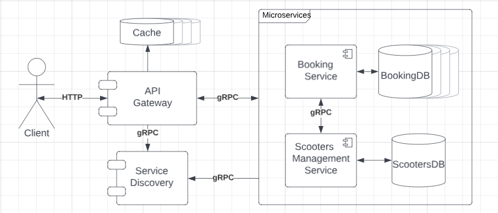

# Distributed Applications Course
#### Technical University of Moldova 2023

## Scooters Renting service

### How to run?
Clone the repo, cd to the root of the project and run:
```commandline
    docker compose up --build
```
Now the endpoint can be teste using `localhost:2050`
### Assess Application Suitability

In a scooter rental service, application load can vary significantly based on factors like location, 
time of day, and special events. Microservices enable to scale individual components independently, 
ensuring that the resources are allocated efficiently. For example, the booking service can be scale
during peak hours while keeping other services running at their usual capacity, and due to the multitude of 
data sent by sensors, the scooters management can be scaled a lot more.

### Service Boundaries

The application itself will be composed of two microservices:

 - **Booking Service** - responsible for handling bookings CRUD operations and storing data about the users
 - **ScootersManagement Service** - responsible for scooters CRUD operations, storing data from GPS and
battery sensors



### Booking Service endpoints

1. **POST**: `/book/scooters/{id}`
Create a booking for a scooter with a specific id

Request body:
```JSON
{
  "title": "Ride 1",
  "start": "2023-25-12 23:50:55",
  "user_email": "email@test.com"
}
```
Response body:
```JSON
{
  "id": 1,
  "start": "2023-25-12 23:50:55",
  "user_email": "email@test.com",
  "title": "Ride 1",
  "scooter_id": "2",
  "end": ""
}
```

2. **PATCH**: `/book/{id}/end-ride` End booking by id

No Request Body

Response body:
```JSON
{
  "id": 1,
  "title": "Ride 1",
  "start": "2023-25-12 23:50:55",
  "user_email": "email@test.com",
  "scooter_id": "2",
  "end": "2023-26-12 01:52:51"
}
```

3. GET `/book/{id}` Show booking details by id

No Request Body

Response body:
```JSON
{
  "id": 1,
  "title": "Ride 1",
  "start": "2023-25-12 23:50:55",
  "user_email": "email@test.com",
  "scooter_id": "2",
  "end": "2023-26-12 01:52:51"
}
```
4. **GET** `/book` Get all bookings, may include query params for filtering purposes

No Request Body

Response body:
```JSON
[
  {
    "id": 1,
    "title": "Ride 1",
    "start": "2023-25-12 23:50:55",
    "user_email": "email@test.com",
    "scooter_id": "2",
    "end": "2023-26-12 01:52:51"
  },
  {
    "id": 2,
    "title": "Ride 2",
    "start": "2023-26-12 23:50:55",
    "user_email": "email@test.com",
    "scooter_id": "2",
    "end": ""
  }
]
```

### Scooters Management Service endpoints

1. **GET** `/scooters/{id}` show scooter by id

No Request Body

Response body:
```JSON
{
"id": 1,
"label": "0001",
"battery_life": "48",
"location": "52.4343242,-1.32324",
"is_charging": 1
}
```

2. **GET** `/scooters` show all scooters, may include query params for filtering

No Request Body

Response body:
```JSON
[
  {
    "id": 1,
    "label": "0001",
    "battery_life": "48",
    "location": "52.4343242,-1.32324",
    "is_charging": 1
  },
  {
    "id": 2,
    "label": "0002",
    "battery_life": "100",
    "location": "52.4341242,-1.32324",
    "is_charging": 0
  }
]
```

3. **PATCH** `/scooters/{id}` update scooters information by id

Request Body
```JSON
{
  "label": "0001",
  "battery_life": "18",
  "location": "52.4343242,-1.32324",
  "is_charging": 1
}
```

No Response body

4. **DELETE** `/scooters/{id}` delete scooter by id

No Request Bod

No Response body

5. **POST** `/scooters` create scooter

Request Body
```JSON
{
  "label": "0001",
  "battery_life": "18",
  "location": "52.4343242,-1.32324",
  "is_charging": 1
}
```

Response body
```JSON
{
  "id": 2
  "label": "0001",
  "battery_life": "18",
  "location": "52.4343242,-1.32324",
  "is_charging": 1
}
```

### Technology Stack

For the implementation, **nodeJs** will be used for creating microservices and for API Gateway and Service Discovery,
**Python** will be used. Inter services communication will be performed synchronously using **gRPC** communication,
but the client application will send basic **HTTP** requests.

### Data Management Design

Each service will operate on separate MySQL databases, to enhance performance of the system, a Redis cacheing
system will be implemented at the level of API Gateway.

### Deployment and Scaling

The services and databases will containerized using Docker.

### Cache High Availability and Consistent Hashing

Redis Cluster automatically shards data across multiple Redis nodes, which means 
that it spreads the data across different nodes in the cluster. Each node holds a 
subset of the hash slots, and every key is hashed into one of these slots. In Redis Cluster, the consistent 
hashing is somewhat abstracted from the user, as Redis takes care of assigning keys to hash slots.  

### 2 Phase commits

A saga is a sequence of local transactions where each transaction updates data within a 
single service. If one transaction fails, saga orchestrates a series of compensating transactions 
that undo the changes that were made by the preceding transactions. So the transaction will begin in 
Booking Service - it will attempt to update scooter service in case it was successful - the update of
the booking service will be attempt - else will fire an unsuccessful response to the user.

### ELK Stack

The ELK Stack is a collection of three open-source products — Elasticsearch, Logstash, 
and Kibana — from Elastic.

**Step 1:** Install Elasticsearch, Logstash, and Kibana

**Step 2:** Configure Logstash

**Step 3:** Start Logstash

**Step 4:** Send Logs to Logstash

**Step 5:** Explore Data with Kibana

The info that i will log is the request and responses and the data will be used to analyse the 
bussines logic of the app let's say.

### Database redundancy/replication + failover

The scooter database will be replicated using mater-slave replication in mysql database system.
